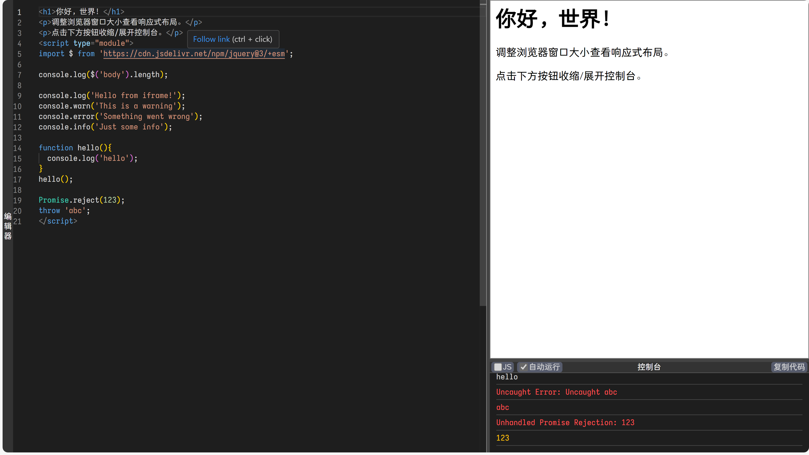

# Monaco 前端编辑器与实时预览

这是一个功能丰富的在线前端代码编辑器，基于强大的 Monaco Editor 构建。它允许用户实时编写 HTML 和 JavaScript 代码，并在旁边的预览面板中即时查看结果，同时提供一个集成的控制台来捕获和显示日志及错误信息。

该工具特别适合快速原型制作、代码片段测试、教学演示以及任何需要即时反馈的前端开发场景。

在线体验：[HTML/JS Playground](https://viocha.github.io/run-web/)



## ✨ 主要特性

*   **强大的代码编辑体验**:
    *   基于 Monaco Editor (VS Code 的核心编辑器)。
    *   支持 HTML 和 JavaScript 语法高亮、智能提示、自动补全。
*   **实时预览**:
    *   代码更改后，预览区域会自动或手动更新。
*   **集成控制台**:
    *   捕获 `iframe` 内的 `console.log`, `console.warn`, `console.error`, `console.info` 输出。
    *   捕获未处理的 JavaScript 错误和 Promise rejections。
*   **灵活的布局**:
    *   **响应式设计**: 自动适应不同屏幕尺寸，在宽屏和窄屏下提供不同的布局（水平/垂直排列）。
    *   **可折叠面板**: 编辑器区域和控制台区域均可通过点击按钮进行折叠和展开。
    *   **可拖拽调整大小**: 用户可以通过拖动面板之间的分隔条来自由调整编辑器、预览和控制台的大小。
*   **模式切换与控制**:
    *   **HTML/JavaScript 模式**: 可在纯 HTML (带 `<script>` 标签) 和纯 JavaScript 模式之间切换。
        *   HTML 模式：编辑器编辑完整 HTML 文档，预览直接渲染。
        *   JS 模式：编辑器编辑纯 JavaScript 代码，预览在一个基础 HTML 模板中运行此 JS
    *   **自动运行**: 可切换是否在代码更改后自动刷新预览。
    *   **复制代码**: 一键复制编辑器中的所有代码到剪贴板。
*   **URL 参数化配置**:
    *   通过 URL 参数可以预设初始代码、语言模式以及面板的折叠状态。

## 🛠️ URL 参数

您可以通过在 URL 中添加查询参数来自定义初始状态：

*   `code=<URL编码的代码>`: 设置编辑器的初始代码。
    *   示例: `?code=<h1>Hello%20World</h1>`
*   `lang=<html|js>`: 设置初始语言模式。默认为 `html`。
    *   示例: `?lang=js`
*   `no-editor`: 初始时折叠编辑器面板。
    *   示例: `?no-editor`
*   `no-console`: 初始时折叠控制台面板。
    *   示例: `?no-console`

**组合示例**:
`index.html?code=console.log('Hello%20from%20JS!');&lang=js&no-editor`
这个链接会以 JS 模式加载，编辑器中预填 `console.log('Hello from JS!');`，并且编辑器面板初始为折叠状态。

## 🔧 技术栈与实现细节

*   **编辑器**: [Monaco Editor](https://microsoft.github.io/monaco-editor/) (通过 CDN 加载)
*   **DOM 操作与事件处理**: [jQuery](https://jquery.com/) (通过 CDN 以 ESM 方式加载)
*   **布局**:
    *   主要使用 Flexbox 实现响应式和动态布局。
    *   CSS `@media` 查询用于处理宽屏和窄屏的不同布局策略。
    *   JavaScript 控制面板的折叠/展开动画和尺寸调整。
*   **预览沙箱**:
    *   使用 `<iframe>` 作为代码执行的沙箱环境。
    *   通过 `URL.createObjectURL` 和 `Blob` 动态生成 `iframe` 的 `src`，以加载用户代码。
*   **控制台**:
    *   `iframe` 内的 `console` 对象方法被重写，通过 `parent.appendToConsole` 将消息传递到主页面的控制台区域。
    *   `window.onerror` 和 `window.onunhandledrejection` 用于捕获 `iframe` 内的全局错误和未处理的 Promise 拒绝。
*   **面板拖拽调整大小**:
    *   自定义的 `addDragListener` 和 `addResizeListener` 函数实现，通过监听 `mousedown`, `mousemove`, `mouseup` 事件来模拟分隔条的拖拽行为。
*   **代码组织**:
    *   所有 HTML, CSS, 和 JavaScript 代码都在一个 `index.html` 文件中。
    *   JavaScript 使用 ES Modules (`<script type="module">`)。

## 📁 文件结构

```
.
└── index.html  (包含所有 HTML, CSS, 和 JavaScript)
```
